-   [ggords](#ggords)
    -   [Installation](#installation)
    -   [Example Usage](#example-usage)
    -   [ggpca](#ggpca)
    -   [ggpnmds](#ggpnmds)
    -   [License](#license)

<!-- README.md is generated from README.Rmd. Please edit that file -->
ggords
======

The package provides six functions: `ggpca()`, `ggca()`, `ggpcoa()`, `ggnmds()`, `ggrda()`, `ggcca()`. You can customize the display labels and themes. Labels can contain formulas. Image themes can be set by themes in ggplots or by other packages(ggthemr).

Installation
------------

``` r
library(devtools)
install_github("wdy91617/ggords")
```

Example Usage
-------------

``` r
library(ggords)
require(vegan)
#> Loading required package: vegan
#> Loading required package: permute
#> Loading required package: lattice
#> This is vegan 2.4-4
require(ggplot2)
#> Loading required package: ggplot2
data(Envs)
```

### get group factor

``` r

Env.w <- hclust(dist(scale(Envs)), "ward.D")
gr <- cutree(Env.w , k=4)
grl <- factor(gr)
```

ggpca
-----

### Compute PCA

``` r
Env.pca <- rda(Envs,scale = TRUE)
#head(summary(Env.pca))
```

### Produce a plot

``` r
ggpca(Env.pca)
```

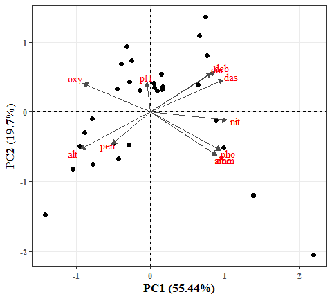

### Add a group

``` r
ggpca(Env.pca, group = grl) 
```

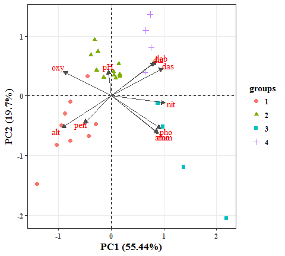

### Set a theme

``` r
ggpca(Env.pca, group = grl, spacol = "white") + theme_dark()
```

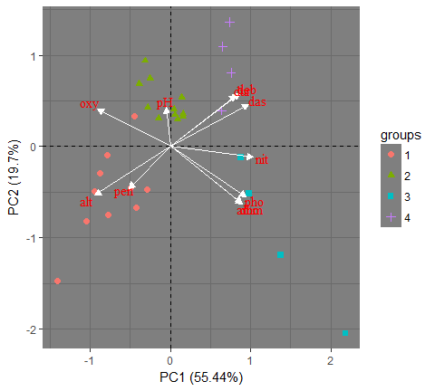

### Set a theme (use ggthemr packages, more themes in ggthemer)

[](https://github.com/cttobin/ggthemr)

``` r
library(ggthemr)

chalk_theme <- ggthemr('chalk', set_theme = FALSE)
fd_theme <- ggthemr('flat dark', set_theme = FALSE)

p <- ggpca(Env.pca, group = grl, spacol = "white")
p + chalk_theme$theme
```

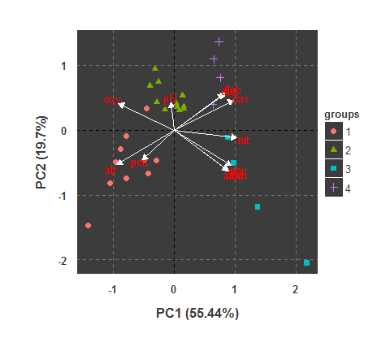

``` r
p + fd_theme$theme
```

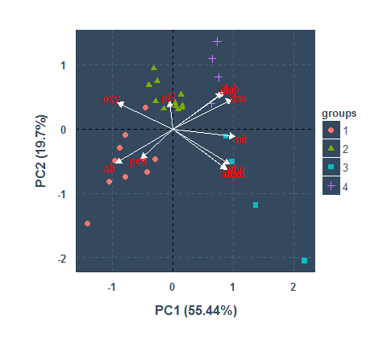

### Remove the arrow

``` r
ggpca(Env.pca, group = grl, spearrow = NULL)
```

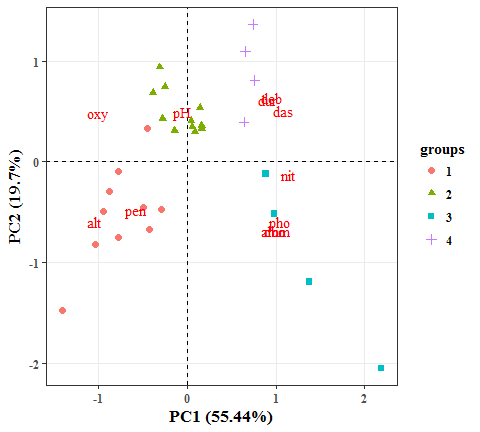

### Modify legend title, group color and point shape

``` r
ggpca(Env.pca, group = grl, spearrow = NULL) + 
  scale_color_manual(name = "Groups",values = c("red2", "purple1", "grey20","cyan")) +
  scale_shape_manual(name = "Groups",values = c(8,15,16,17))
```

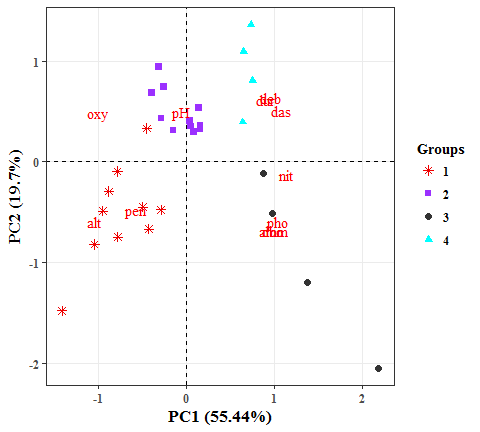

### Add confidence ellipses

``` r
ggpca(Env.pca, group = grl, spearrow = NULL, ellipse = TRUE) +
  scale_colour_hue(l = 70, c = 300)
```

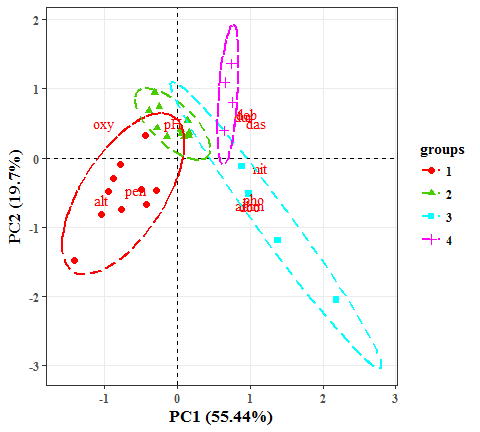

ggpnmds
-------

### Compute NMDS

``` r
Env.nmds <- metaMDS(Envs, distance="bray")
#> Square root transformation
#> Wisconsin double standardization
#> Run 0 stress 0.04321381 
#> Run 1 stress 0.04321426 
#> ... Procrustes: rmse 0.00010572  max resid 0.0004830601 
#> ... Similar to previous best
#> Run 2 stress 0.06230586 
#> Run 3 stress 0.04321502 
#> ... Procrustes: rmse 0.0002722217  max resid 0.001267347 
#> ... Similar to previous best
#> Run 4 stress 0.043215 
#> ... Procrustes: rmse 0.000809664  max resid 0.003723171 
#> ... Similar to previous best
#> Run 5 stress 0.06971945 
#> Run 6 stress 0.04321513 
#> ... Procrustes: rmse 0.0008290728  max resid 0.003866836 
#> ... Similar to previous best
#> Run 7 stress 0.04321577 
#> ... Procrustes: rmse 0.0003821437  max resid 0.001779355 
#> ... Similar to previous best
#> Run 8 stress 0.04321558 
#> ... Procrustes: rmse 0.0003565797  max resid 0.001660052 
#> ... Similar to previous best
#> Run 9 stress 0.04321535 
#> ... Procrustes: rmse 0.0008673308  max resid 0.004048399 
#> ... Similar to previous best
#> Run 10 stress 0.06230603 
#> Run 11 stress 0.07548094 
#> Run 12 stress 0.04321406 
#> ... Procrustes: rmse 9.994844e-05  max resid 0.0003305759 
#> ... Similar to previous best
#> Run 13 stress 0.06230814 
#> Run 14 stress 0.04321379 
#> ... New best solution
#> ... Procrustes: rmse 1.288564e-05  max resid 3.434517e-05 
#> ... Similar to previous best
#> Run 15 stress 0.06230628 
#> Run 16 stress 0.04321363 
#> ... New best solution
#> ... Procrustes: rmse 0.000504177  max resid 0.002357129 
#> ... Similar to previous best
#> Run 17 stress 0.04321576 
#> ... Procrustes: rmse 0.0004078088  max resid 0.001900373 
#> ... Similar to previous best
#> Run 18 stress 0.06230651 
#> Run 19 stress 0.0432154 
#> ... Procrustes: rmse 0.0003616041  max resid 0.00168172 
#> ... Similar to previous best
#> Run 20 stress 0.07029134 
#> *** Solution reached
#head(summary(Env.nmds))
```

### Produce a plot

``` r
ggnmds(Env.nmds)
```

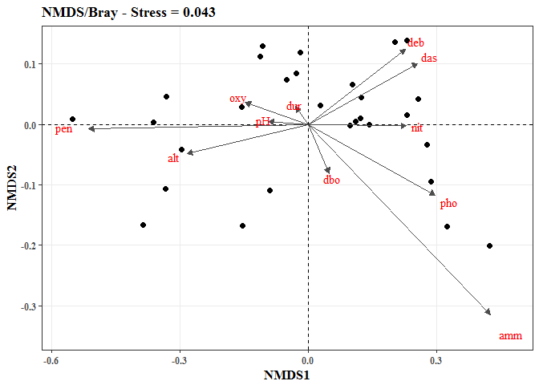

### Add a group

``` r
ggnmds(Env.nmds, group = grl) 
```

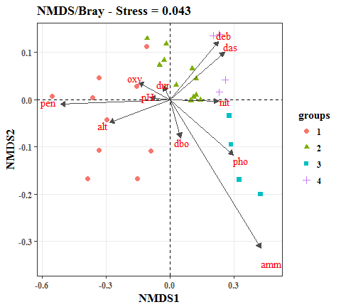

### Set a theme

``` r
ggnmds(Env.nmds, group = grl, spacol = "white") + theme_dark()
```

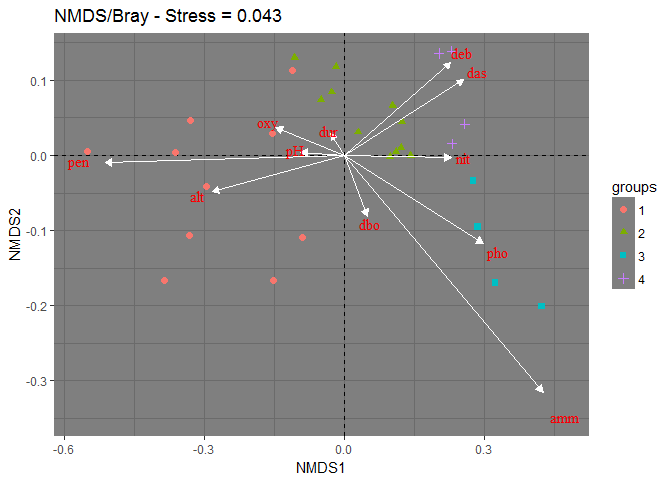

### Set a theme (use ggthemr packages, more themes in ggthemer)

[](https://github.com/cttobin/ggthemr)

``` r

library(ggthemr)

chalk_theme <- ggthemr('chalk', set_theme = FALSE)
fd_theme <- ggthemr('flat dark', set_theme = FALSE)

p <- ggnmds(Env.nmds, group = grl, spacol = "white")
p + chalk_theme$theme
```

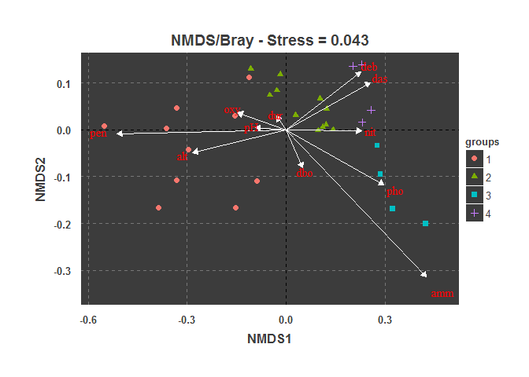

``` r
p + fd_theme$theme
```

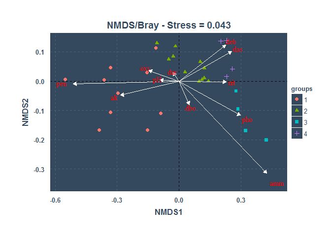

### Remove the arrow

``` r
ggnmds(Env.nmds, group = grl, spearrow = NULL)
```

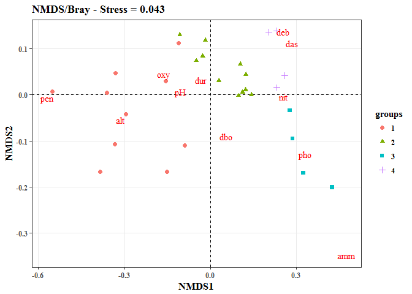

### Set labels

``` r
mlabs<-c("NH[4]^{`+`}" , "NO[3]^{`-`}" ,"delta^13*C","A[1]","sqrt(2*pi)","frac(x^2,2)",
         "sin(x)","hat(x)","bar(xy)","90*degree","x^{y+z}")

ggnmds(Env.nmds, group = grl, spearrow = NULL, msplabs = mlabs)
```

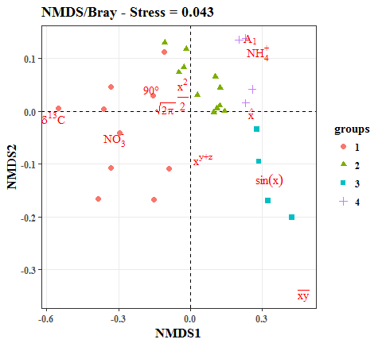

### Modify legend title, group color and point shape

``` r
ggnmds(Env.nmds, group = grl, spearrow = NULL) + 
  scale_color_manual(name = "Groups",values = c("red2", "purple1", "grey20","cyan")) +
  scale_shape_manual(name = "Groups",values = c(8,15,16,17))
```

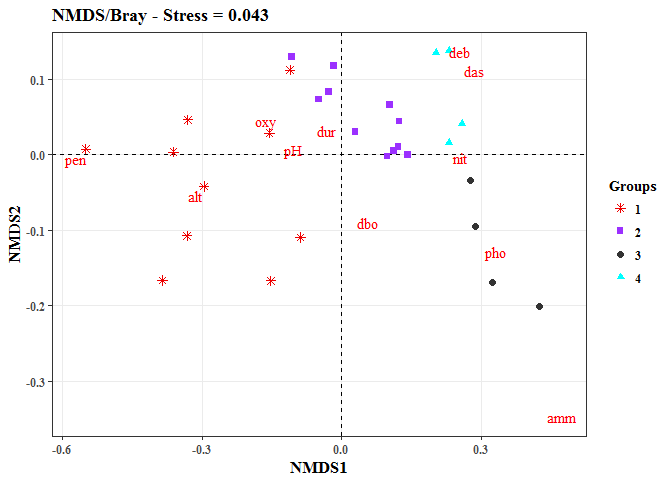

### Add confidence ellipses

``` r
ggnmds(Env.nmds, group = grl, spearrow = NULL, ellipse = TRUE) +
  scale_colour_hue(l = 70, c = 300)
```

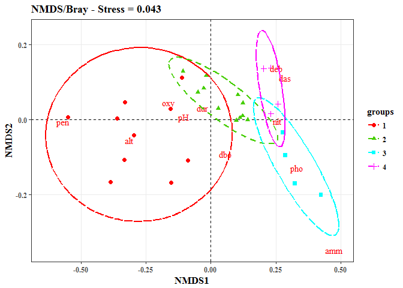

License
-------

Released under GPL-3.
